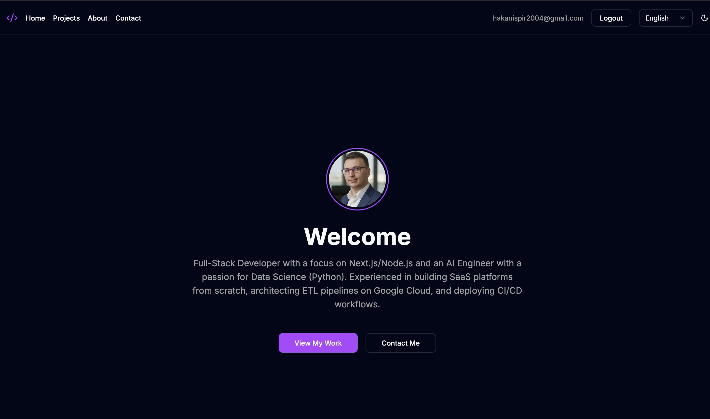

# Personal Portfolio & Blog

[](https://opensource.org/licenses/MIT)

A modern, high-performance personal portfolio website built with the latest technologies, featuring a full-featured admin panel for content management, internationalization, and dynamic OG image generation.



### ✨ Core Features

-   **Bilingual Content (i18n):** Fully localized for English and Turkish using `next-intlayer`, including translated URL slugs.
-   **Dynamic Content Management:** A secure admin panel to create, update, and delete projects.
-   **Markdown Support:** A rich markdown editor with live preview for project descriptions.
-   **Secure Authentication:** Admin-only access using `next-auth` with credentials provider.
-   **File Uploads:** Project thumbnail uploads handled by Vercel Blob storage.
-   **Contact Form:** A server-side contact form that sends emails using Resend.
-   **Dynamic OG Images:** On-the-fly Open Graph image generation for rich social sharing.
-   **Theming:** Dark/Light mode support with `next-themes`.
-   **Database & ORM:** Built with Vercel Postgres and Drizzle ORM for type-safe database access.

---

### 🚀 Tech Stack

| Category                 | Technology                                                                                                                  |
| ------------------------ | --------------------------------------------------------------------------------------------------------------------------- |
| **Framework**            | [Next.js](https://nextjs.org/) 16 (App Router)                                                                              |
| **Language**             | [TypeScript](https://www.typescriptlang.org/)                                                                               |
| **Styling**              | [Tailwind CSS](https://tailwindcss.com/) v4 & [shadcn/ui](https://ui.shadcn.com/)                                           |
| **Database**             | [Vercel Postgres](https://vercel.com/storage/postgres) (Neon)                                                               |
| **ORM**                  | [Drizzle ORM](https://orm.drizzle.team/)                                                                                    |
| **Authentication**       | [Auth.js (NextAuth v5)](https://authjs.dev/)                                                                                |
| **Internationalization** | [Intlayer](https://www.intlayer.dev/) (v7)                                                                                  |
| **File Uploads**         | [Vercel Blob](https://vercel.com/storage/blob)                                                                              |
| **Email**                | [Resend](https://resend.com/)                                                                                               |
| **UI Components**        | [Radix UI](https://www.radix-ui.com/), [Framer Motion](https://www.framer.com/motion/), [Lucide React](https://lucide.dev/) |
| **Form Management**      | [React Hook Form](https://react-hook-form.com/) & [Zod](https://zod.dev/)                                                   |
| **Logging**              | [Winston](https://github.com/winstonjs/winston)                                                                             |
| **Deployment**           | [Vercel](https://vercel.com/)                                                                                               |

---

### 🛠️ Prerequisites

-   Node.js: `v18.17` or higher
-   Package Manager: `pnpm` (`npm install -g pnpm`)
-   Vercel CLI: Optional, for local environment variable management (`npm i -g vercel`)

---

### ⚙️ Getting Started

1.  **Clone the repository:**

    ```bash
    git clone https://github.com/your-username/portfolio.git
    cd portfolio
    ```

2.  **Install dependencies:**

    ```bash
    pnpm install
    ```

3.  **Set up environment variables:**
    Copy the `.env.example` file to a new file named `.env.local`.

    ```bash
    cp .env.example .env.local
    ```

    Update the variables in `.env.local` with your own credentials.
    _Tip: If your project is linked to Vercel, you can pull database credentials by running `vercel env pull .env.local`._

4.  **Push the database schema:**
    This command syncs your schema (`lib/schema.ts`) with your Vercel Postgres database.

    ```bash
    pnpm drizzle-kit push
    ```

5.  **Seed the admin user:**
    This portfolio uses a closed authentication system. To create your initial admin account, open `scripts/seed.ts`, set your desired email and password, and then run the script:
    ```bash
    npx tsx scripts/seed.ts
    ```

---

### 🏃 Available Scripts

-   `pnpm dev`: Starts the development server.
-   `pnpm build`: Creates a production build of the application.
-   `pnpm start`: Starts the production server.
-   `pnpm lint`: Lints the codebase using ESLint.
-   `pnpm drizzle-kit push`: Pushes the Drizzle ORM schema to the database.
-   `pnpm drizzle-kit studio`: Opens the Drizzle Studio to view and manage data.

---

### 📂 Project Structure

```
.
├── app/
│   ├── [locale]/             # Localized routes (e.g., /en, /tr)
│   │   ├── (public)/         # Publicly accessible pages
│   │   └── (admin)/          # Protected admin dashboard
│   ├── actions/              # Server Actions for form submissions, etc.
│   └── api/                  # API routes (auth, OG images)
├── components/
│   ├── admin/                # Components for the admin dashboard
│   ├── layouts/              # Global layout components (Header, Providers)
│   ├── public/               # Components for public-facing pages
│   └── ui/                   # Reusable UI primitives from shadcn/ui
├── lib/
│   ├── auth.ts               # Auth.js configuration
│   ├── db.ts                 # Drizzle DB instance
│   ├── schema.ts             # Database schema for Drizzle ORM
│   └── actions.ts            # Server Actions logic
├── scripts/
│   └── seed.ts               # Script to seed the initial admin user
├── .env.example              # Example environment variables
├── drizzle.config.ts         # Drizzle Kit configuration
├── intlayer.config.ts        # Intlayer i18n configuration
└── next.config.ts            # Next.js configuration
```

---

### 🚢 Deployment

Deployment is designed for [Vercel](https://vercel.com/).

1.  Push your code to a GitHub repository.
2.  Import the project into Vercel.
3.  Connect the Vercel Postgres and Vercel Blob storage integrations.
4.  Add the required environment variables (`AUTH_SECRET`, `RESEND_API_KEY`, etc.) in the Vercel project settings.
5.  Deploy!

---

### 📄 License

This project is open source and available under the [MIT License](https://opensource.org/licenses/MIT).
